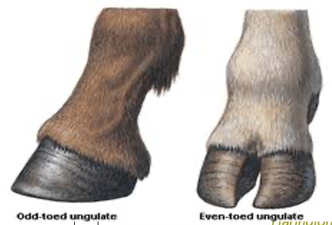
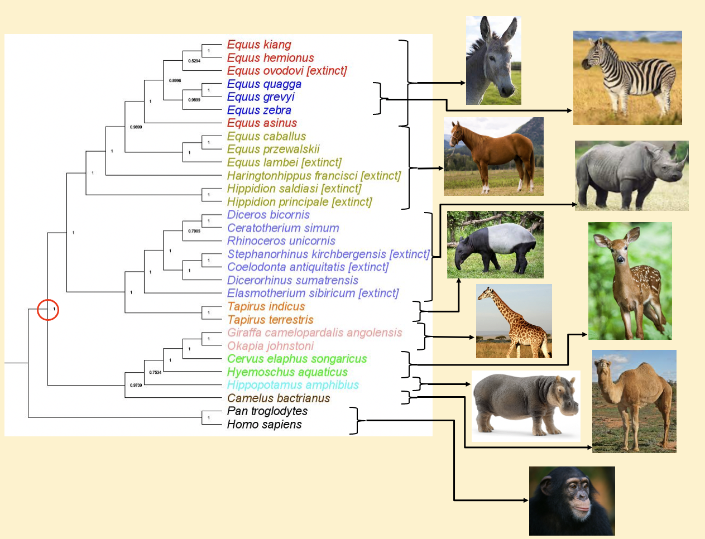

```{r setup, include=FALSE}
knitr::opts_chunk$set(echo = TRUE)
#Remember: CMD + SHIFT + K -> will output the HTML view. 
```
<p>DESCRIPTION: In the following project, I attempted to recreate the results of a phylogenetic analysis carried out with MEGAX software, IQ-Tree software, and FigTree software by solely utilizing R and Rstudio to match those results. </p>

### **Are Perissodactyla and Cetartiodactyla Monophyletic?**



<br></br>


### **INTRODUCTION**
<p>Before the abundance of molecular data, scientists had classified that within hoofed mammals or ungulates, there were two sub groups: perissodactyla(odd-toed) and cetartiodactyla(even-toed). Even-toed ungulates equally bear weight on two of the five toes, whereas Odd-toed ungulates bear weight on one of their five toes. In recent years, there has been uncertainty about the monophyly and classification of each of these ungulate groups due to increasing availability of molecular data. In our analysis, we seek to determine if perissodactyla and cetartiodactyla are two separate monophyletic groups based on the analysis of their full mitochondrial genome.</p>

### **OBJECTIVES**
<p>- Gain new insights into the evolution of ungulates.
- Have a better understanding on current data on ungulate evolution, through the analysis of full mitochondrial genome
- Determine whether perissodactyla and cetartiodactyla are monophyletic groupings</p>

### **METHODS**

#### **METHOD 1: USING  MEGAX software, IQ-Tree software, and FigTree software**
<p>DNA sequences were retrieved from NCBI using the taxonomy browser. Sequences were chosen arbitrarily first from Equidae then from all Perissodactyal and Cetartiodactyla. Humans and chimpanzees were used as outgroups. The sequences were aligned using MUSCLE in MEGAX. After the alignment was complete, sections of the complete genomes across all taxa were excised because they were deemed not homologous. ModelFinder from IQ-TREE was then used to determine that TIM2+F+I+G4 was the best model for the maximum likelihood reconstruction. MEGAX was used to construct the ML tree using the closest model, the general time reversible model, with 5000 replicates for bootstrap values. The tree was visually edited and enhanced using FigTree v1.4.4.</p>

<br></br>



<br></br>

#### **METHOD 2: USING only R and Rstudio**

### **RESOURCES USED**
Tidyverse, ape, muscle, ggtree, and other libraries were used for completing this assignment. 
```{r, message=FALSE, warning=FALSE}
library(tidyverse)
library(ShortRead)
library(msa)
library(phangorn)
library(seqinr)
library(adegenet)
library(ape)
library(ggtree)
library(DECIPHER)
library(viridis)
library(ggplot2)
library(muscle)
library(purrr)


```
### **LOADING THE DATA**
Loading the raw DNA nucleotide data. Reading the fasta file and assigning it to a dataframe 
```{r, warning=FALSE}
#   1. ALIGNING THE RAW SEQUENCES
#reading the fasta file and assigning it to a dataframe
raw_sequences <- readDNAStringSet("./ungulates.fasta")

#glimpse at the raw nucleotide sequences
raw_sequences


```

### **ALIGNING THE RAW SEQUENCES**
<li> Reorienting the sequences is necessary to prepare the data for alignment. Once that is done, a muscle alignment was performed on the nucleotide data.</li>
```{r, message=FALSE, warning=FALSE}

#Re-orienting nucleotide sequences 
oriented_sequences <- OrientNucleotides(raw_sequences)


#aligning the similarities between the sequences 
#and turning them all to the same length

#muscle alignment
muscle_aligned_sequences <- muscle(oriented_sequences)

```

<li> Excising non-coding regions and converting the multiple alignment format into string format </li>
```{r, message=FALSE, warning=FALSE}
muscle_dnastr = as(muscle_aligned_sequences, "DNAStringSet") #this excises the non coding regions, and turns the multiple alignment into DNAstring
```

<li> Changing the label names of the nucleotide sequences </li>
```{r, message=FALSE, warning=FALSE}
# change labels to show the Species names.
names(muscle_dnastr)#glimpsing at the current labels

#We go into the location of the names, and then divide each string based on spaces.
#Then we select the second and third field. 
#We paste those fields together and separate them by a "_"
muscle_dnastr@ranges@NAMES <-
paste( muscle_dnastr@ranges@NAMES %>% str_split(pattern = " ") %>%map_chr(2),
       muscle_dnastr@ranges@NAMES %>% str_split(pattern = " ") %>%map_chr(3),
       sep = "_")

names(muscle_dnastr) #taking a glimpse at the names after the change


```

<li> Visualizing the alignment in a Web Browser </li>
```{r, message=FALSE, warning=FALSE}
#viewing the sequences in a browser
BrowseSeqs(muscle_dnastr)
```

<li> Saving the alignment </li>
```{r, message=FALSE, warning=FALSE}
#We do this step in order to be able to build a tree
#writing the aligned data
writeXStringSet(muscle_dnastr, file ="ungulates_muscle_aligned.fasta")
```


### **BULDING THE PHYLOGENETIC TREE**
<li> Loading the aligned DNA nucleotide data set </li>
```{r, warning=FALSE}
#Reading the aligned file
dna <- read.alignment("ungulates_muscle_aligned.fasta", format = "fasta")

```

<li> Creating a Distance matrix for the aligned sequences to visualize similarities  </li>
```{r, message=FALSE, warning=FALSE}
#Creating a Distance matrix for the aligned sequences 
d_matrix <- dist.alignment(dna, matrix = "similarity")
d_matrix

```

<li> Visualizing the Distance matrix of the aligned DNA nucleotide squences </li>
```{r, message=FALSE,  warning=FALSE}
#Creating a Distance matrix for the aligned sequences 
#Visualizing the distance matrix
#darker = farther, lighter= closer sequences
d_matrix_table <- as.data.frame(as.matrix(d_matrix))
table<- table.paint(d_matrix_table, cleg=0, clabel.row = .5, clabel.col = .5)+
  scale_color_viridis()
table
```

<li> Clustering the sequences using the Neighbor Joining method (nj), and we turn the tree object into a class </li>
```{r, message=FALSE, warning=FALSE}
tree <- nj(d_matrix)
class (tree)
#Ladderizing based on the distance matrix
tree <- ladderize(tree)
```

<li> In this part, the outgroup was rearraged to be forced out of the phylogeny </li>
```{r, message=FALSE, warning=FALSE}
tree<- root(tree, outgroup = "Pan_troglodytes", resolve.root = TRUE)

```

<li> Finally, we plot the phylogenetic tree, and statically highlight the portions that we want to have stand out for the analysis of results. </li>
```{r, message=FALSE, warning=FALSE}
ggtree(tree, branch.length = "none") +
  #geom_tiplab()+
  geom_tiplab(hjust= -.3)+
  geom_text(aes(label=node), size=2.5, hjust=-.8)+
  geom_point2(aes(subset=(node==43)), shape=21, size=5, fill='red')+
  geom_point2(aes(subset=(node==59)), shape=21, size=5, fill='green')+
  geom_hilight(node=43, fill="orange") +
  geom_hilight(node=c(12,50), fill="blue") +
  geom_cladelabel(node=50, label="Zebras", 
                  color="purple", offset=5, align=TRUE) +
  geom_cladelabel(node=43, label="Donkeys", 
                  color="orange", offset=7, align=TRUE) +
  #geom_hilight(node=46, fill="gold")
  xlim(0,20)

```


<br></br>


### **ANALYSIS**
<p>Based on our molecular phylogenetic analysis of the full mitochondrial genomes of our taxa, the orders of Perissodactyla (Odd-toed ungulates) and Cetartiodactyla (Even-toed ungulates) are considered to be both monophyletic groups. There is a bootstrap value of 100% at the split between the orders giving us confidence in this conclusion. However, future analysis of the full nuclear genomes may support or refute this conclusion.
Further items of interest include that the grouping of Zebras is contained within the grouping of Donkeys. Both of these groups have a most recent common ancestor from the family Equidae (horses). It is commonly believed that horses and zebras were each other’s closest relatives. However, our data suggests that zebras are more closely related to donkeys than they are to horses.</p>

### **CONCLUSION**
<p>
<ol> <li> Focusing solely on the methods by which we obtained the analysis results, R and Rstudio have proven to be powerful tools to accomplish tasks that might have taken 2 or 3 more distinct software to accomplish.</li> 
<li>We have been able to come to the same conclusion by using two different ways of analysis. </li> 
<li>An interesting finding remains that Zebrase are contained within the grouping of Donkeys instead of horses.</li>
</ol>

</p>


### **REFERENCES**
<p>
<li>Steiner, C. C., Mitelberg, A., Tursi, R., & Ryder, O. A. (2012). Molecular phylogeny of extant equids and effects of ancestral polymorphism in resolving species-level phylogenies. Molecular Phylogenetics and Evolution, 65(2), 573-581. doi:10.1016/j.ympev.2012.07.010</li>
<li>Janis, C. M. (1988). New ideas in ungulate phylogeny and evolution. Trends in Ecology & Evolution,3(11), 291-297. doi:10.1016/0169-5347(88)90104-8</li>
<li>Janis C. (2008) An Evolutionary History of Browsing and Grazing Ungulates. In: Gordon I.J., Prins H.H.T. (eds) The Ecology of Browsing and Grazing. Ecological Studies, vol 195. Springer, Berlin, Heidelberg</li>
<li>RStudio Team (2020). RStudio: Integrated Development for R. RStudio, PBC, Boston, MA. http://www.rstudio.com/.</li>

</p>


<br></br>
**Ernie Vilela - 2020**
<br></br>

<br></br>
 [Click to here visit Github Repository](https://github.com/ErnieVc/Data_Course_VILELA){target="blank"}